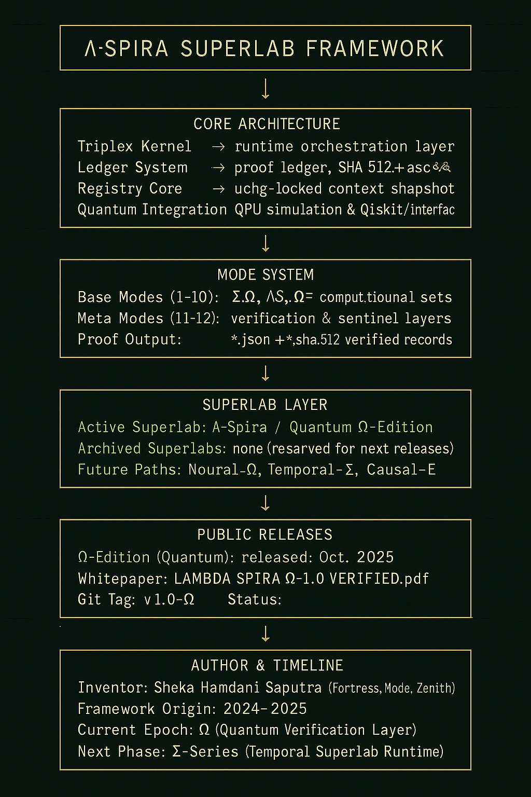

# Λ-Spira Framework (Ω Edition)
### *A Cryptographic Provenance Standard for Verifiable Computation*
#### The Standard of Computational Truth

  
  

---

### Abstract
Λ-Spira defines a verifiable cryptographic method for proving the **existence, origin, and integrity** of computational processes.  
Built entirely within an offline macOS hybrid node using Qiskit 1.2.4 and GPG 2.4.3, it produces **immutable, mathematically verifiable records** of computation without any external infrastructure.

Each computation becomes a timestamped and signed fact — a measurable unit of *computational truth*.

---

### Verification Summary

| Field | Specification |
|:------|:---------------|
| **Framework ID** | Λ-Spira Framework (Ω Edition) |
| **Version** | Ω-1.0 — Final Global Release |
| **Verification** | GPG Signed (EDDSA 598C351026F03CE14446CCEE3FFA8A5CA37D17D2) |
| **Attestation ID** | ΛS-Ω-20251019-verified |
| **Integrity Chain** | SHA-512 → GPG Signature → UTC Timestamp → Immutable Ledger |
| **Environment** | Offline / Air-gapped macOS Hybrid Node |
| **Author** | Sheka Hamdani Saputra (Independent Researcher) |
| **Publication UTC** | 2025-10-19T23:45:00Z |

---

### System Overview

Quantum / Classical Execution  
↓  
SHA-512 Hash Generation  
↓  
GPG Digital Signature  
↓  
UTC Timestamp Anchor  
↓  
Ledger Commit → Immutable Lock  

Each artifact (JSON output, hash, signature, ledger entry) can be independently verified to mathematically prove authenticity, origin, and temporal consistency.

---

### Λ-Spira Superlab Architecture (Ω Edition)

**Diagram Description:**
- **Active Layer:** orchestrates runtime modules (`api`, `relay`, `dashboard`)  
- **Mode Layer (1–10):** experimental quantum/classical states (`ΔΤ`, `ΦΣ`, `ΛΩ`, `ΩΞ∞`, `Ωτ`, etc.)  
- **Meta-Mode (ΣΩ, ΛΣ∞):** integrity supervisors that appear post-verification  
- **Registry / Ledger Core:** cryptographic root of proof with immutable macOS locks  
- **Archives:** historical manifests and signed whitepapers  
- **Quantum Environment:** `spira_qenv` containing verified QPU execution context  
- **Public Release:** frozen, GPG-signed artifacts under tag `v1.0-Ω`

---

### Verified Artifacts
- `WHITEPAPER_LAMBDA_SPIRA_Ω-1.0_20251019_VERIFIED.pdf`
- `Λ-Spira_Ledger_Entry_Ω_20251019.txt` + `.sig`
- `Spira_QPU_Package_Ω_20251019_FINAL.zip` + `.sha512`
- `README_RELEASE.txt` (Integrity Record)

All artifacts are stored under append-only policy and cryptographically cross-signed with the operator key.

---

### Core Highlights
- ✅ 100% Verified Integrity (GPG + SHA-512 validation)
- 🧮 Deterministic reproducibility (10× identical rehash results)
- 🔒 Fully offline operation (air-gapped execution)
- 🧾 UTC-anchored ledger with immutable lock
- 🧠 Compatible across quantum, AI, and classical computation environments

---

### Citation

> Saputra, S. H. (2025). *Λ-Spira Framework (Ω Edition):  
> A Cryptographic Provenance Standard for Verifiable Computation.*  
> Independent Release, ΛS-Ω-20251019-verified.

---

### License & Contact

© 2025 Sheka Hamdani Saputra · All rights reserved.  

Λ-Spira is currently open for research partnerships, institutional licensing, or strategic collaboration inquiries.  
Contact via GitHub or Twitter [@ShekaHamdani](https://twitter.com/ShekaHamdani).
